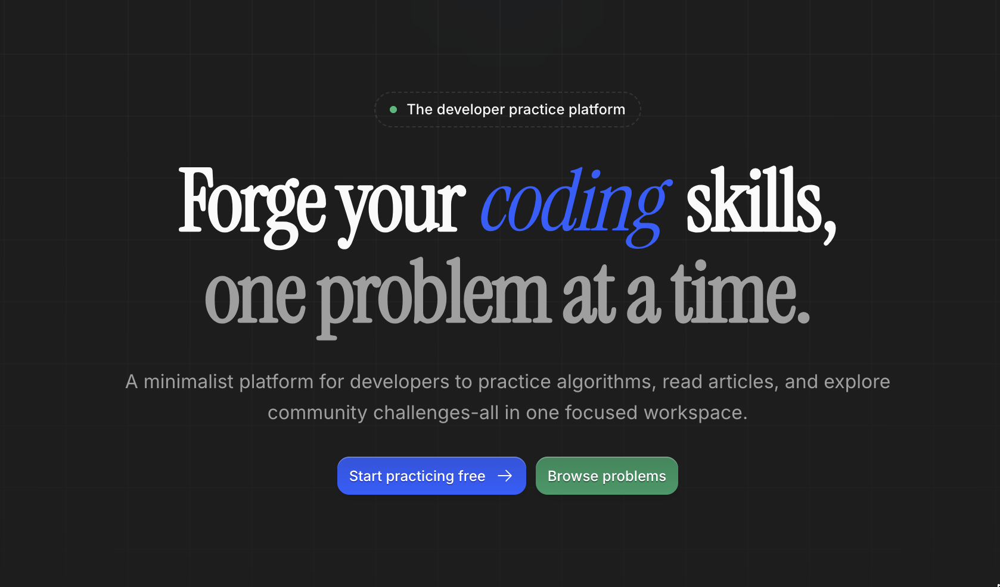

# Codeforge

Codeforge is a Next.js frontend for a programming platform that combines articles, problem sets, and challenge runners. It includes a CodeMirror-based code editor, Markdown article renderer, React Query data layer, and responsive UI components for quick local development and production deployment.

## Setup

- Install dependencies:

```
pnpm install
```

- Run in development:

```
pnpm dev
```

- Build for production:

```
pnpm build
pnpm start
```

## Notes

- Requires Node 18+ and `pnpm` installed globally.
- Place environment variables in `.env.local` when needed.

